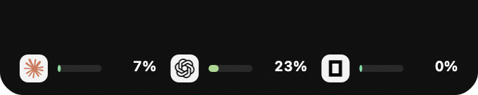
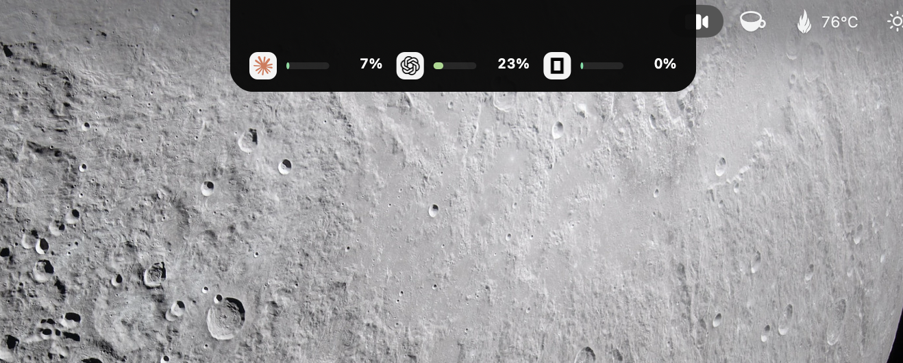
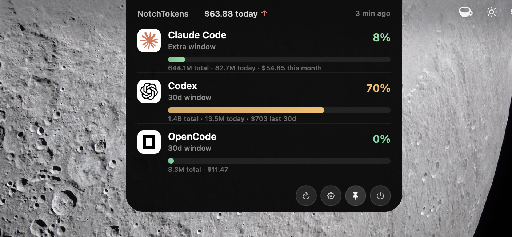

# NotchTokens

A macOS menu-bar/notch app that tracks token usage and cost across **Claude Code**, **OpenAI Codex CLI**, and **OpenCode** at a glance.

<p align="center">
  <br>
</p>

Hover the notch (or click the menu-bar item) to expand a panel with per-harness usage bars (green → yellow → red as you approach rate limits), live cost totals, and a today-vs-yesterday trend. Providers nearing a limit are flagged with a warning glyph and an optional notification; rows are clickable to open the provider's dashboard (⌘-click copies the stats), and hovering a row reveals a per-model cost breakdown.

<details>
<summary>Screenshots in context</summary>

<p align="center">
  <br>
  
</p>

</details>

## Requirements

- macOS 13 (Ventura) or later — works **with or without a notch** (notch panel on notched Macs, menu-bar item otherwise; configurable)
- Xcode 16+ to build
- At least one of: Claude Code, Codex CLI, or OpenCode installed and used locally

## Install

```bash
git clone <repo> && cd NotchTokens
open NotchTokens.xcodeproj
# Product → Archive → Distribute App → Custom → Copy App
# Drag NotchTokens.app into /Applications
```

First launch: right-click the app → **Open** → **Open** (Gatekeeper bypass, one time only since the build is locally signed).

To start automatically, enable **Launch at login** in the app's Settings (gear button → General).

## How it works

All data is read locally — no scraping, no API keys to paste:

| Harness | Usage source | Limit source |
|---|---|---|
| Claude Code | `~/.claude/projects/**/*.jsonl` for tokens + cost | Anthropic's OAuth usage endpoint, using the OAuth token from the existing Claude Code Keychain entry, for live 5h / 7-day limits |
| Codex | `~/.codex/sessions/**/*.jsonl` and `~/.codex/archived_sessions/**/*.jsonl` for tokens + cost | Embedded `rate_limits` for Short / Long windows when present, plus optional rolling 30-day budget |
| OpenCode | `~/.local/share/opencode/storage/message/**/*.json`; cost is pre-computed by OpenCode itself | Optional rolling 30-day budget |

Pricing is sourced from [LiteLLM's `model_prices_and_context_window.json`](https://github.com/BerriAI/litellm), refreshed daily, with an embedded snapshot for offline use. OpenCode uses its own per-message cost field instead.

Codex and OpenCode budget bars use rolling last-30-day spend. Claude Code uses the live limit windows returned by Anthropic.

The Claude OAuth token is read via `/usr/bin/security` from the existing `Claude Code-credentials` Keychain entry — you'll get one macOS permission prompt on first run; click "Always Allow." No new credentials needed.

## Features

- **At-a-glance bars** per harness, colored by how close you are to a limit.
- **Usage alerts** — a warning glyph (and optional system notification) when a provider crosses a configurable threshold (default 80%); a distinct error glyph when a fetch fails.
- **Combined daily spend** with a today-vs-yesterday trend arrow.
- **Per-model breakdown** on row hover (e.g. Opus vs Sonnet, or each OpenCode model).
- **Clickable rows** — open the provider's usage dashboard, or ⌘-click to copy the stats.
- **Two display modes** — notch panel or menu-bar item, auto-selected by hardware or set manually.
- **Launch at login**, refresh-in-progress feedback, and VoiceOver support.

## Refresh cadence

- Usage and limit data refresh on launch, every 60 seconds after launch, and whenever you click the refresh button.
- Claude live limits are fetched every refresh unless the Anthropic request fails. Failures use exponential backoff and cached limits are reused while waiting.
- Codex and OpenCode budgets are recalculated from the last 30 days on every refresh.

## Settings

Open the gear button in the panel footer:

- **Launch at login** — start NotchTokens automatically.
- **Display** — Auto (notch when available, else menu bar), Notch panel, or Menu bar.
- **Rolling 30-day budgets** for Codex and OpenCode — local dollar budgets that render synthetic 30-day usage bars. Claude Code needs no budget; it exposes live limit windows.
- **Visible providers** — show/hide each harness.
- **Usage alerts** — the warning threshold and whether to post notifications.

## License

NotchTokens is released under the MIT License — see [LICENSE](LICENSE). Contributions are welcome; see [CONTRIBUTING.md](CONTRIBUTING.md).

## Acknowledgments

Approach inspired by [ccusage](https://github.com/ryoppippi/ccusage), [Tokscale](https://github.com/junhoyeo/tokscale), [Notchi](https://github.com/sk-ruban/notchi), and [CodexBar](https://github.com/steipete/CodexBar).
